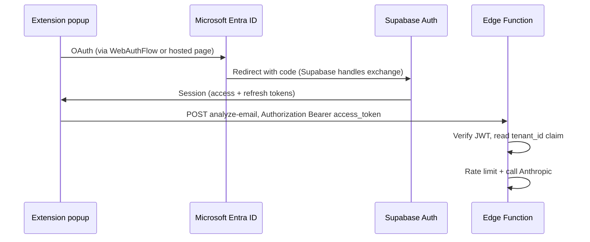

# Multi-tenant logins — implementation plan

This doc is the **auth + login** slice of multi-tenancy: how each **organization** and **user** is identified after Microsoft sign-in. For isolation models (RLS vs project-per-tenant), see [`MULTI-TENANT-PLAN.md`](./MULTI-TENANT-PLAN.md).

---

## 1. End state (what “done” looks like)

| Actor | Today | Target |
|-------|--------|--------|
| **User** | Pastes proxy URL + shared `EXTENSION_TOKEN` | **Sign in with Microsoft** → session stored in extension |
| **Organization** | Not represented in auth | **`tenant_id`** on user (JWT claim + DB) |
| **API** | `x-extension-token` only | **`Authorization: Bearer <supabase_access_token>`** (+ optional legacy token during migration) |
| **Logs / feedback** | `token_key` (hash of shared secret) | **`tenant_id` + `user_id`** (from JWT `sub`) |

---

## 2. Architecture (high level)

Supabase remains the **token issuer** your Edge Functions trust; Microsoft is the **identity provider** Supabase federates to.

---

## 3. Recommended phases

### Phase 0 — Decisions (before code)

- [ ] **Entra app:** Multi-tenant (any Azure AD org) vs single-tenant (only your company) for v1.
- [ ] **Tenant onboarding:** Invite-only (admin creates tenant, adds users) vs domain auto-claim (higher risk).
- [ ] **Migration:** Keep `EXTENSION_TOKEN` working in parallel for **X weeks** (dual auth) or hard cutover.

### Phase 1 — Database (no extension yet)

1. **`tenants`** table: `id` (uuid), `name`, `slug`, `created_at`, optional `settings` jsonb.
2. **`tenant_members`** (or `profiles`): `user_id` (uuid → `auth.users`), `tenant_id`, `role` (`admin` | `member`), unique `(user_id)` if one tenant per user for v1.
3. **RLS:** policies drafted; service role for Edge Functions until JWT path is proven.
4. **Auth hook** (Supabase **Custom Access Token Hook** or database trigger on signup): after first sign-in, attach **`tenant_id`** (and `role`) to JWT `app_metadata` or use a pattern Supabase documents for custom claims.

*Deliverable:* A test user in Supabase Auth with `tenant_id` visible in JWT (decode at [jwt.io](https://jwt.io) in staging only).

### Phase 2 — Edge Functions

1. Deploy `analyze-email` / `report-feedback` with **`--verify-jwt`** (or validate JWT in code using project JWT secret).
2. Read **`sub`** (user id), **`tenant_id`** from claims (exact path depends on hook shape).
3. **Dual auth (optional):** If no `Authorization` header, fall back to `x-extension-token` for legacy installs.
4. Rate limit key: **`tenant_id` + `sub`** (or tenant-only for coarse limit).
5. Insert `scan_log` / `user_feedback` with `tenant_id` / `user_id` columns (migration).

*Deliverable:* `curl` with `Authorization: Bearer <user_jwt>` returns 200 on ping or analyze in staging.

### Phase 3 — Extension

1. **`manifest.json`:** add **`identity`** permission if using `chrome.identity.launchWebAuthFlow`.
2. **OAuth redirect:** Use Supabase’s documented OAuth URL for **Sign in with Azure**; redirect must match Entra app registration + Supabase dashboard allow list.
3. **Popup UI:** “Sign in with Microsoft”, display email/name, “Sign out”; hide or collapse “Connection” for SaaS builds, or keep “Advanced” for self-hosted.
4. **`chrome.storage.local`:** store `supabase_access_token`, `supabase_refresh_token`, `expires_at` (or session object); **never** store Microsoft client secret.
5. **`background.js`:** attach `Authorization: Bearer ${accessToken}` to analyze + feedback; **refresh** token on 401 using Supabase REST `/auth/v1/token?grant_type=refresh_token` (or JS client in offscreen/popup — pick one place to avoid duplication).
6. **Service worker:** run refresh from a user gesture or retry path so MV3 sleep does not strand users.

*Deliverable:* Fresh install → sign in → analyze email without pasting extension token.

### Phase 4 — Tenant lifecycle (product)

- Admin UI (could be Supabase Studio + manual SQL at first): create tenant, invite user by email, assign `tenant_members`.
- Optional: **Stripe** / billing keyed by `tenant_id` (out of scope for login-only milestone).

---

## 4. Microsoft Entra checklist

1. App registration → **Authentication** → add redirect URIs Supabase specifies for Azure provider.
2. **Certificates & secrets** → client secret for Supabase provider config (stored in Supabase dashboard, not in repo).
3. **Token configuration** — optional: ensure `email`, `tid` (tenant id) available if you enforce “only these Azure tenants.”
4. **Multi-tenant:** set supported account types to **multitenant** if customers bring their own M365; validate `tid` in hook if you allowlist customers.

---

## 5. Supabase checklist

1. **Authentication → Providers → Azure** — client ID, secret, optional tenant hint for single-tenant.
2. **URL configuration** — Site URL + redirect URLs include OAuth callbacks.
3. **Custom Access Token Hook** (or equivalent) — inject `tenant_id` into JWT for Edge Functions.
4. **Edge Functions secrets** — no change to Anthropic key; JWT verification uses platform-managed key when verify-jwt is on.

---

## 6. Security notes

- Treat **user access token** like a password in storage; clear on sign-out.
- **RLS** must align with JWT claims; integration tests per table.
- **CORS** on Edge Functions stays locked to Outlook origins; Bearer auth does not replace origin checks for browser abuse patterns.
- Update **`PRIVACY.md`** when you collect Microsoft account identifiers and tenant membership.

---

## 7. Effort (rough)

| Phase | Calendar (part-time) |
|-------|----------------------|
| Phase 1 DB + hook | 2–4 days |
| Phase 2 Edge Functions | 2–3 days |
| Phase 3 Extension OAuth + refresh | 4–7 days |
| Phase 4 Admin / invites | 3–10+ days |

Parallel work: Entra + Supabase dashboard (same day as Phase 1 start).

---

## 8. Out of scope for “logins” milestone

- Per-tenant Anthropic API keys (billing model decision).
- Full self-service signup without invites.
- Chrome Web Store identity requirements (separate checklist when you publish).

---

**Related:** [`MULTI-TENANT-PLAN.md`](./MULTI-TENANT-PLAN.md) · [`PRIVACY.md`](../PRIVACY.md) · [`README.md`](../README.md)
